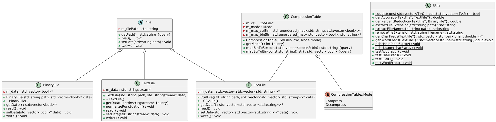
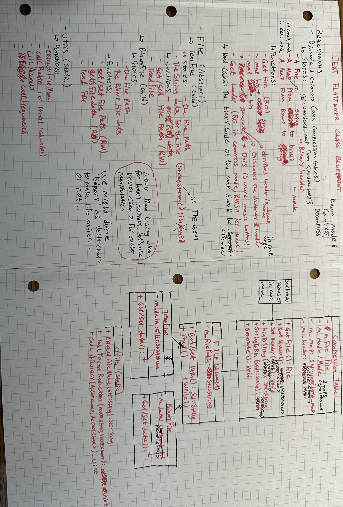

# TextFlattener

A very simple C++ text compression program. Only supports 61 of the 256 ASCII characters: a-z, A-Z, ., ,, -, !, ', ", \n, space. All other characters are represented as #.

## THIS WAS COMPLETED FOR THE ECS 101 COMPRESSION GROUP PROJECT

*What source files do what?*

- You will find the main flag parsing logic, input error handling, and high-level function calls in `main.cpp`
- You will find one abstract and three children classes for the purpose of reading and writing to/from Binary, Text, and CSV files in `File.h` and `File.cpp`
- You will find various testing, generation, and printing utilities in `Utils.h` and `Utils.cpp`
- You will find the functions that deal with converting between string and binary, alongside the parsing logic for the compression table, in `CompressionTable.h` and `CompressionTable.cpp`
- You will see an optional cosmetic printing library (I created several years ago) allowing for colored console text in `Ctxt/*`


*What are the other files?*

- `README.md` offers a brief overview of the program's functionality and design, as well as sparse instructions for building and running the program on windows.
- `right.ahk` was used during debugging to find errors in long input texts
- `Makefile` is responsible for streamlining the multifile compilation in C++
- `sample/*` files were used during initial testing
- `frequency_generation_source/*` files include the document we analyzed to extract character and word frequencies for our fixed compression table
- `documents/*` are files submitted to the other assignments in blackboard
- `diagrams/*` include the brainstorming done before beginning to code, the generated UML Class Diagram for the completed code, and a visual representation of that diagram
- `csv/*` files include our precious `table.csv`, and other formats delivered by David. Only `table.csv` is read by the program.

## UML Class Diagram


## UML Draft (Pre-code planning)


Note: Dynamic runtime dictionary approach was eliminated by professor limitation

## Building & Running - Windows
---
1. Ensure a c++ compiling toolchain is installed (i.e. Cygwin, MSVC, etc.) with support for make
2. Ensure the make command is on your path (or simply copy the path to the make executable)
3. Open powershell and change directory to the unzipped source directory
4. Execute the following command (where \<make\> is either the path to the make executable if not added to path)
```
<make> -j8
```
5. Execute the program like so:
```
./main
```
6. Help will be printed to the screen. Use the following command to print more detailed help:
```
./main help
```